> 📘 **Academic Notice**  
> **This mobile application was developed as part of the _Mobile Application Development_ module – _Self Assignment 2_.**

# 💪 FitMe – Fitness & Wellness Android App

FitMe is a mobile fitness application designed to support users in maintaining a healthy lifestyle by helping them calculate their **Body Mass Index (BMI)**, plan daily meals, and set reminders for meals and workouts. The app is suitable for fitness beginners, students, and busy individuals who want an easy way to manage their health routines. FitMe focuses on simplicity and usability, providing a clean and intuitive interface that allows users to enter their height and weight to calculate BMI, organize meal plans, and schedule alarms without complexity.

The app UI is designed entirely using **Android XML** and follows modern UI/UX principles. The main features include a BMI calculator screen, a meal planning screen, and an alarm reminder screen for meals and workouts. Navigation between screens is handled using **Android intents**. Although the app does not implement backend logic, it demonstrates strong UI structure, layout organization, and a user-friendly screen flow suitable for a real fitness application.

---

## 🎨 Color Usage – 60-30-10 Rule

The FitMe app follows the **60-30-10 color rule** to ensure visual balance and a pleasant user experience.

- **60% – Light Blue**  
  Light blue is used as the **primary color** for backgrounds and main layout areas. This color creates a calm, fresh, and healthy feeling, making it suitable for a fitness and wellness application.

- **30% – Dark Blue**  
  Dark blue is used as the **secondary color** for headers, cards, and important sections. It adds contrast, improves readability, and gives the app a professional and structured appearance.

- **10% – White**  
  White is used as the **accent color** for buttons, icons, text highlights, and important UI elements. This helps draw user attention to key actions such as calculating BMI, saving meal plans, and setting alarms.

All colors are defined and managed using the `colors.xml` file to maintain consistency across the application.

---

## ⚙️ App Features

- **BMI Calculator**  
  Allows users to enter height and weight to calculate BMI and understand their health status.

- **Meal Planning**  
  Enables users to plan daily meals to support better nutrition and healthy eating habits.

- **Meal & Workout Alarms**  
  Users can set alarms for meals and workouts to stay on schedule.

- **User-Friendly UI**  
  Uses proper layouts, spacing, and readable text for ease of use.

- **Navigation Using Intents**  
  Smooth screen navigation using Android intents.

---

## 🛠 Technologies Used

- Android XML (UI Design)
- Android Studio
- Material Design Components
- Intents for Navigation

---

## 📸 Screenshots

### Screenshot Gallery

  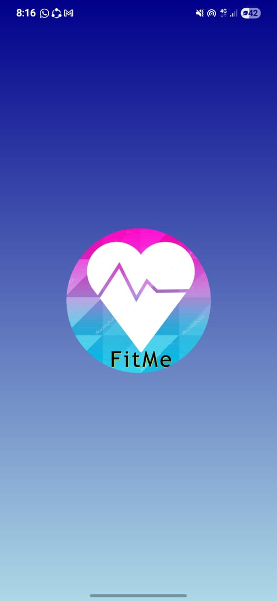
  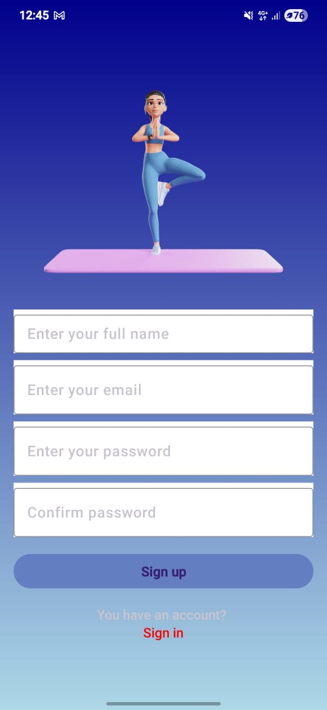
  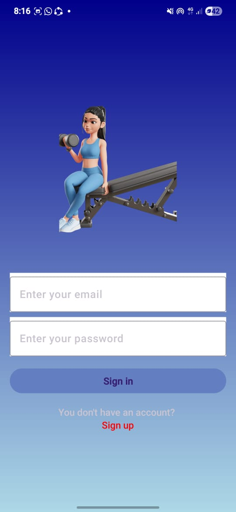
  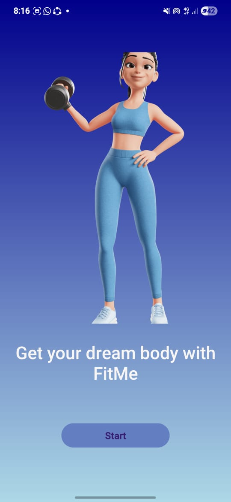

  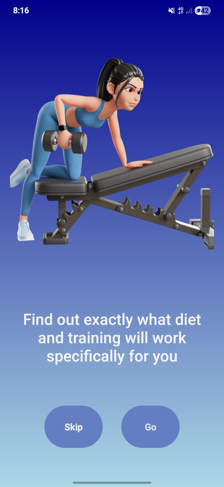
  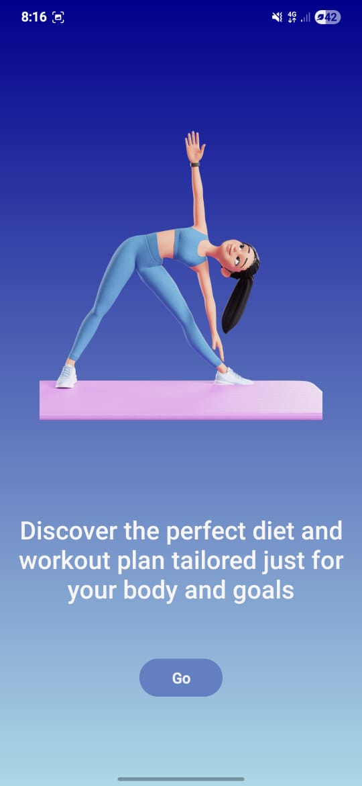
  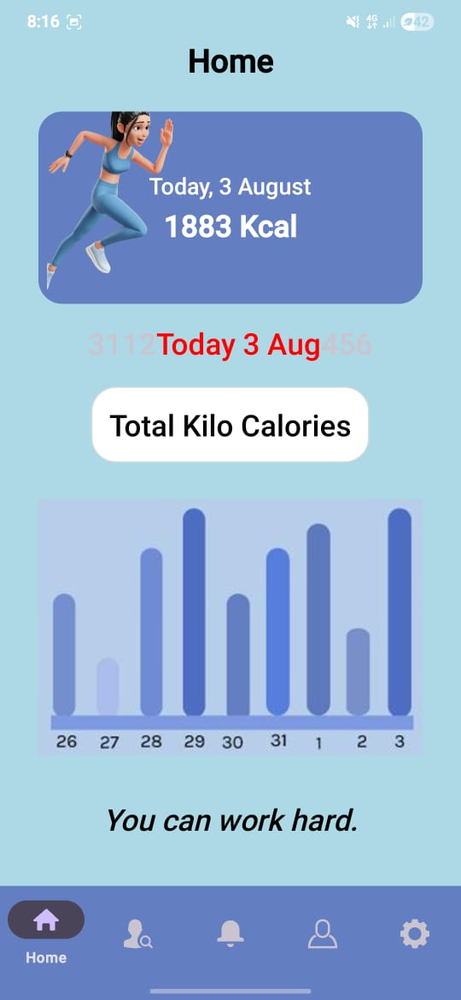
  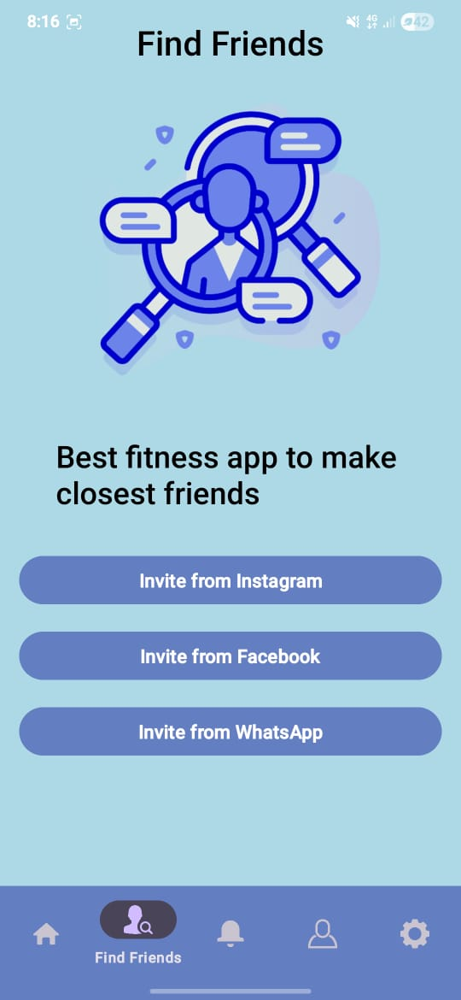

  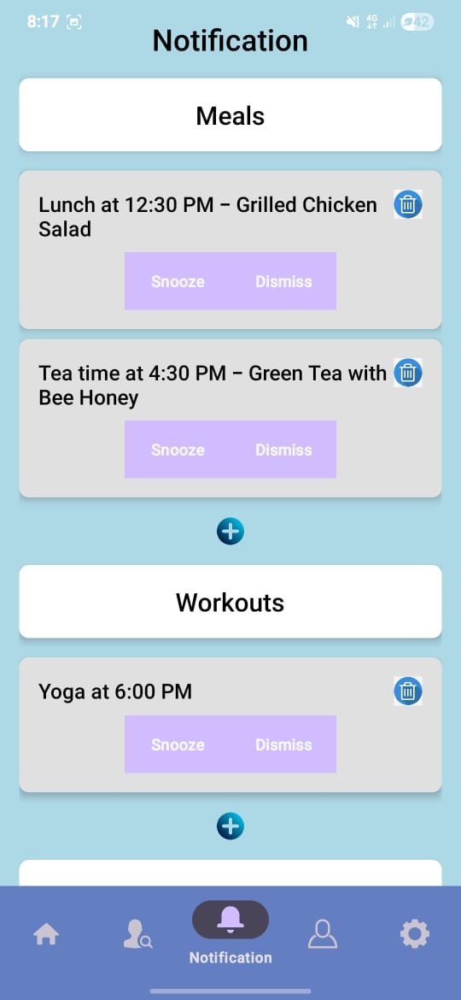
  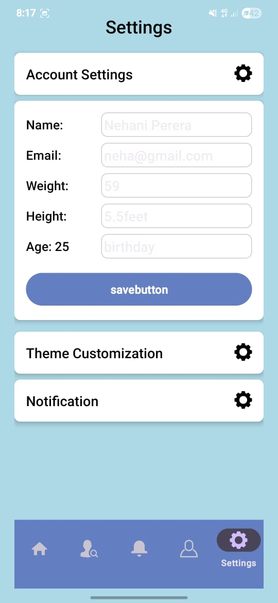
  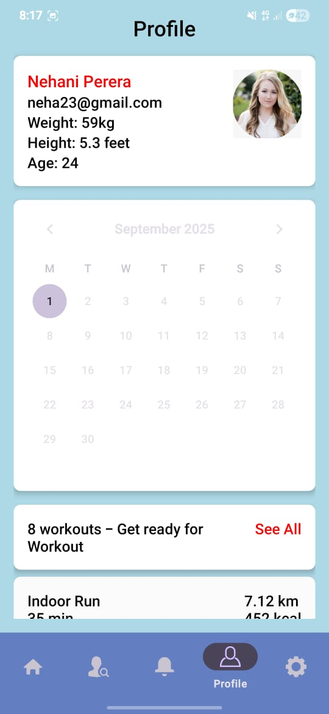
  

